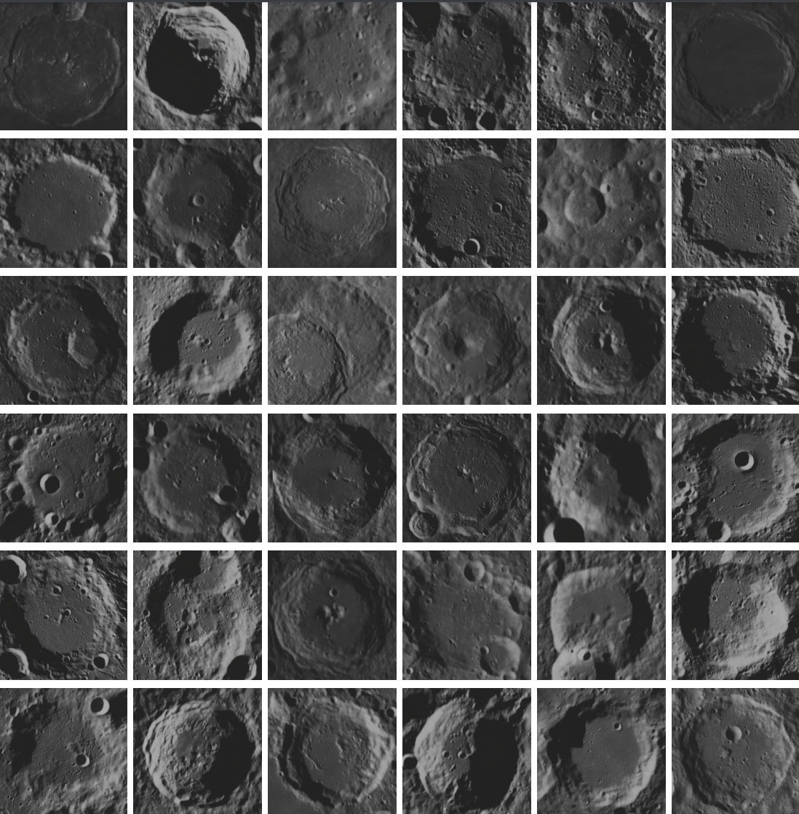
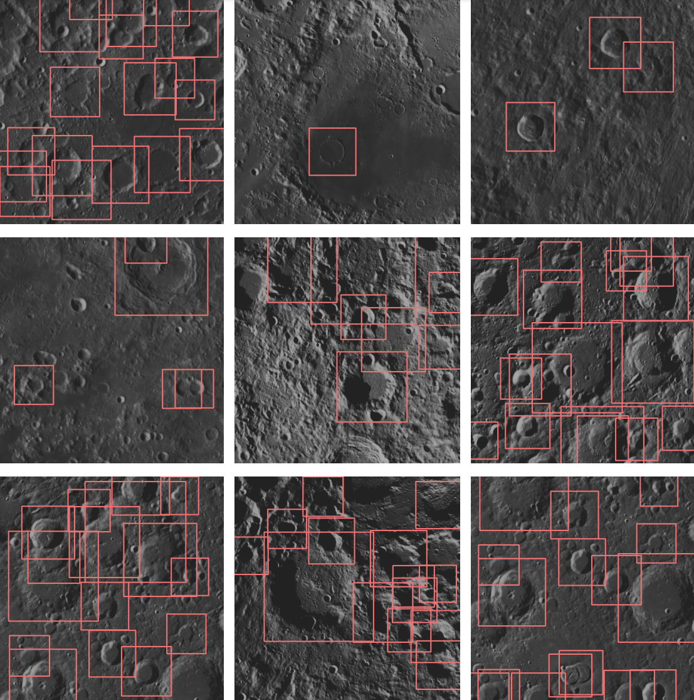

# The Luna-1 Moon Crater Landmarks Dataset
### [Project Page](https://droneslab.github.io/mars/) | [Paper (Coming Soon)]() | [Download Link]()
This is the supporting dataset to the ECCV 2024 paper: ***MARs: Multi-view Attention Regularizations for Patch-based Feature Recognition of Space Terrain***. It contains 5,067 cropped images of craters on the surface of the Moon, generated in the Blender software using publicly available NASA mission data. Also included are 2,109 replicate orbital navigation frames from real-world Lunar Reconnaissance Orbiter (LRO) spacecraft poses with ground-truth bounding box annotations. For more details, please check out the paper.

<p float="left">
  
   
</p>

## Dataset Structure
```
├── crater_images/          # Crater images                                                                                            
│   └── 1.png
|   └── 2.png
|   └── ...
│                                                                                               
├── lro_navigation/         # Replicate LRO navigation frames and supporting data
|   ├── nav_images/         # Navigation frames
│   |   └── 1.png
|   |   └── 2.png
|   |   └── ...
|   ├── poses/              # LRO spacecraft pose data used for navigation frame generation
|   |   └── LROCWAC_22Sep06_000000_6H_10S_poses.csv             # Raw poses
|   |   └── kitti_LROCWAC_22Sep06_000000_6H_10S_poses.txt       # KITTI formatted poses
|   |   └── blender_world_poses.txt                             # Blender poses
|   └── annotations.txt     # Bounding box nav image annotations
|   └── view_boxes.py       # Script for visualizing bounding box annotations
```

## Miscellaneous Details
- Navigation frame orbital period: 00:00 September 6, 2022 -> 06:00 September 6, 2022, every 10 seconds. 
- First orbit frames:   0-703
- Second orbit frames:  704-1406
- Third orbit frames:   1407-2109
- Blender camera FOV:   39.6

## Citation
If you use this dataset in your work, please cite with the bibtex entry below:
```
@inproceedings{chase2024mars,
  title={MARs: Multi-view Attention Regularizations for Patch-based Feature Recognition of Space Terrain},
  author={Timothy Chase Jr and Karthik Dantu},
  year={2024},
  booktitle={ECCV},
}
```